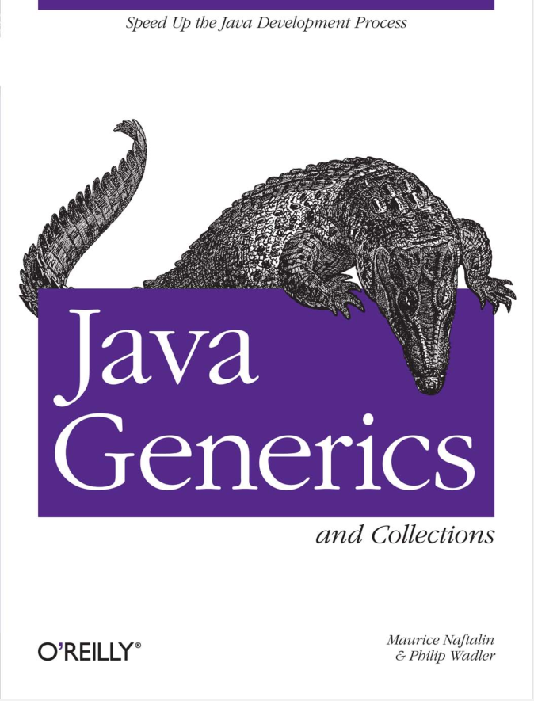

# Java-Generics-and-Collections

# 还在翻译中
 
- gitbook: [https://gc.study365.cc](https://gc.study365.cc)
- pageServer: [https://gc.study365.fun](https://gc.study365.fun)

---

:book: Java Generics and Collections

---

* [前言](Preface.md)
  * [获取示例程序](Preface.md#获取示例程序)
  * [如何联系我们](Preface.md#如何联系我们)
  * [本书中使用的约定](Preface.md#本书中使用的约定)
  * [Safari®联机丛书](Preface.md#Safari®联机丛书)
  * [致谢](Preface.md#致谢)
* [第一部分：泛型](ch01/00_Introduction.md)
  * [第一章(简介)](ch01/00_Introduction.md#第一章(简介))
    * [泛型](ch01/01_Generics.md#泛型) 
    * [装箱与拆箱](ch01/02_Boxing_and_Unboxing.md#装箱与拆箱)
    * [循环](ch01/03_Foreach.md#循环)
    * [泛型方法和可变参数](ch01/04_Generic_Methods_and_Varargs.md#泛型方法和可变参数)
    * [断言](ch01/05_Assertions.md#断言)
  * [第二章(子类型化和通配符)](ch02/00_Subtyping_and_Wildcards.md#第二章(子类型化和通配符))
    * [子类型化和替代原则](ch02/01_Subtyping_and_the_Substitution_Principle.md#子类型化和替代原则)
    * [通配符和继承](ch02/02_Wildcards_with_extends.md#通配符和继承)
    * [通配符和超类](ch02/03_Wildcards_with_super.md#通配符和超类)
---

### 高清英文版PDF[下载](https://github.com/maskleo/Java-Generics-and-Collections/files/1634266/Java.pdf)

