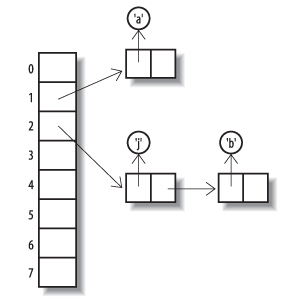

《《《 [返回首页](../README.md)       <br/>
《《《 [上一节](00_Sets.md)

## 实现Set

当我们在第 `12` 章的例子中使用 `Collection` 的方法时，我们强调他们可以使用 `Collection` 的任何实现。 如果我们决定使用集合框架中的一个 `Set` 实现呢？ 我们必须在框架提供的各种具体实现之间进行选择，它们在执行添加，包含和迭代等基本操作的速度以及迭代器返回其元素的顺序上有所不同。 在本节和下一节中，我们将看看这些差异，然后在本章的最后我们将总结不同实现的比较性能。

集合框架中有六个具体的 `Set` 实现。 图 `13-1` 显示了它们与 `Set` 及其子接口 `SortedSet` 和 `NavigableSet` 的关系。 在本节中，我们将看看 `HashSe`t，`LinkedHashSet`，`CopyOnWriteArraySet` 和 `EnumSet`。 我们将在 `13.2` 节讨论 `SortedSet` 和 `NavigableSet`，以及它们的实现 `TreeSet` 和 `ConcurrentSkipListSet`。


图 `13-1`。`Set` 接口的实现


### HashSet

这个类是 `Set` 的最常用的实现。 顾名思义，它是由一个哈希表实现的，这个哈希表是一个数组，其中元素存储在从其内容派生的位置。 由于哈希表按其内容存储和检索元素，因此它们非常适合于实现 `Set` 的操作（集合框架也将它们用于 `Map` 的各种实现）。 例如，要实现 `contains(Object o)，你需要查找元素 `o`，如果发现它，则返回 `true`。

散列表中元素的位置由其内容的散列函数计算。散列函数旨在尽可能地为结果（散列码）传递可能存储的元素值。 例如，这里是类似于 `String` 类中用于计算哈希码的代码：

```java
   int hash = 0;
   for (char ch : str.toCharArray()) {
      hash = hash * 31 + ch;
   }
```

传统上，散列表通过取除除表格长度后的余数来从散列码中获取索引。 集合框架类实际上使用位掩码而不是除法。 因为这意味着哈希码低端的比特模式很重要，所以在计算哈希码时使用素数（例如 `31` ），因为乘以素数不会倾向于将信息从低端 - 例如乘以 `2` 的幂。


图 `13-2`。 带链式溢出的哈希表

想一想，除非您的表的位置多于可能存储的位置，否则有时两个不同的值必须散列到散列表中的相同位置。 例如，没有 `int` 索引的表可以足够大来存储没有冲突的所有字符串值。我们可以通过一个好的散列函数来最小化问题 - 一个散列表中的元素 - 但是，当发生冲突时，我们 必须有一种方法可以将碰撞的元素保存在同一个表格位置或存储桶中。 这通常是通过将它们存储在一个链表中来完成的，如图 `13-2` 所示。 作为 `ConcurrentSkipListSet` 实现的一部分，我们将更详细地查看链表（请参阅第 `13.2.3` 节），但现在看到存储在同一个存储桶中的元素仍然可以被访问， 单元格引用链。 图 `13-2` 显示了在 `Sun` 的 `Java 5` 实现中运行此代码所导致的情况：

```java
   Set<Character> s1 = new HashSet<Character>(8);
   s1.add('a');
   s1.add('b');
   s1.add('j');
```

表格元素的索引值已经通过使用每个元素的哈希码的最低三位（对于长度为 `8` 的表格）来计算。 在这个实现中，一个 `Character` 的哈希码就是它所包含的字符的 `Unicode` 值。 （实际上，哈希表当然会比这个大得多，而且这个图是从实际情况中简化的;因为 `HashSet` 实际上是由专门的 `HashMap` 实现的，链中的每个单元都不包含一个，而是两个 引用一个键和一个值（见第 `16` 章）只有键被显示在这个图中，因为当一个哈希表被用来表示一个集合时，所有的值都是相同的 - 只有键的存在是显着的。）

只要没有冲突，插入或检索元素的成本就是不变的。随着哈希表填满，碰撞变得更可能;假设一个好的散列函数，轻载表中碰撞的概率与其载荷成比例，定义为表中元素的数量除以其容量（桶的数量）。如果碰撞确实发生，则必须创建并随后遍历链表，并且与列表中元素的数量成比例地增加额外的插入成本。如果哈希表的大小是固定的，随着更多的元素被添加并且负载增加，性能将恶化。为防止发生这种情况，当负载达到指定的阈值（其负载因子）时，通过重新哈希复制到新的更大的表来增加表的大小。

迭代散列表需要检查每个存储桶是否被占用，因此花费的时间与散列表的容量加上其包含的元素的数量成正比。由于迭代器依次检查每个桶，因此元素返回的顺序取决于它们的哈希代码，因此不能保证元素将返回的顺序。图 `13-2` 所示的哈希表以降序索引和链表的前向遍历顺序产生其元素。打印它会产生以下输出：

```java
   [j，b，a]
```

在本节的后面，我们将看看 `LinkedHashSet`，这是一个带有迭代器的实现的变体，它不会按照其插入顺序返回元素。

哈希表实现集的主要吸引力是添加，删除，包含和大小的基本操作（理想情况下）的恒定时间性能。其主要缺点是其迭代性能;因为迭代遍历表涉及检查每个存储桶，其成本与表大小成正比，无论其包含的集大小如何。

`HashSet` 具有我们在 `12.3` 节中介绍的标准构造函数，以及两个额外的构造函数：

```java
   HashSet(int initialCapacity)
   HashSet(int initialCapacity, float loadFactor)
```

这两个构造函数都会创建一个空集，但允许对基础表的大小进行一些控制，从而在所提供的容量之后创建一个长度为次最大的 `2` 的幂。 虽然框架的原始设计者 `Joshua Bloch` 告诉我们，新类将不再具有像加载因子这样的配置参数，但是集合框架中大多数基于散列表的实现具有相似的构造函数。 它们通常不是有用的，它们限制了以后改进实现的可能性。

`HashSet` 是不同步的并且不是线程安全的; 它的迭代器是快速失败的。

### LinkedHashSet


图 `13-3`。链接的哈希表

这个类从 `HashSet` 继承，仍然只在一个方面实现 `Set` 和提炼它的超类的契约：它保证它的迭代器将按照它们第一次添加的顺序返回它们的元素。 它通过维护设置元素的链表来完成此操作，如图 `13-3` 中的曲线箭头所示。 该图中的情况将由此代码产生：

```java
   Set<Character> s2 = new LinkedHashSet<Character>(8);
   Collections.addAll(s2, 'a', 'b', 'j');
   // LinkedHashSet的迭代器以正确的顺序返回它们的元素：
   assert s2.toString().equals("[a, b, j]");
```

链接结构在改进迭代性能方面也具有有用的结果：下一步在恒定时间内执行，因为链表可以用于依次访问每个元素。 这与 `HashSet` 相反，无论 `HashSet` 是否被占用，`HashSet` 中的每个桶都必须被访问，但维护链表所涉及的开销意味着只有 `orde`或 `HashSet` 才会选择 `LinkedHashSet` 而不是 `HashSet`。 迭代效率对于您的应用程序非常重要。

`LinkedHashSet` 的构造函数提供了与 `HashSet` 相同的工具来配置底层哈希表。 像 `HashSet` 一样，它是不同步的，不是线程安全的; 它的迭代器是快速失败的。

### CopyOnWriteArraySet

在功能方面，`CopyOnWriteArraySet` 是 `Set` 约定的另一个直接实现，但与 `HashSet` 具有完全不同的性能特征。

这个类是作为一个薄的包装器来实现的，这个包装器是一个 `CopyOnWriteArrayList` 实例，后者又由一个数组支持。这个数组被视为不可变的;对集合内容的更改会导致创建一个全新的阵列。因此，添加复杂度为 `O(n)`，正如包含一样，这必须通过线性搜索来实现。显然你不会在你期待许多搜索或插入的上下文中使用 `CopyOnWriteArraySet`。但是数组的实现意味着迭代每个元素花费 `O(1)` - 比 `HashSet` 快 - 它在一些应用程序中有一个非常有吸引力的优点：它提供了线程安全性（参见 `11.5` 节），而不增加读操作的开销。这与使用锁定来实现所有操作的线程安全的那些集合（例如，第 `17.3.1` 节的同步集合）形成对比。这样的集合是多线程使用的瓶颈，因为线程在以任何方式使用之前都必须独占访问集合对象。相比之下，在写入时复制集合上的读操作是在后备阵列上实现的，后者在创建后从不修改，所以它们可以被任何线程使用，而没有并发写入操作干扰的危险。

你什么时候想要使用具有这些特征的集合？在相当特殊的情况下;一个很常见的问题是实现主题观察者设计模式（请参阅第 `9.5` 节），该模式要求将事件通知给一组观察者。在通知过程中不得更改此套件;通过锁定集实现，读取和写入操作共享确保此操作所需的开销，而使用 `CopyOnWriteArraySet` 时，开销完全由写操作执行。这对主题观察者是有意义的;在此模式的典型用法中，事件通知发生的频率要比侦听器集的更改频率高得多。

`CopyOnWriteArraySet` 的迭代器只能用于读取集合。当它们被创建时，它们被附加到当时由该集合使用的支持数组的实例。由于这个数组的实例不应该被修改，因此迭代器的 `remove` 方法没有实现。这些是快照迭代器（参见 `11.5` 节）;它们反映了创建时的集合的状态，并且随后可以遍历而不会受到修改其派生集合的线程干扰的任何危险。

由于 `CopyOnWriteArraySet` 没有配置参数，构造函数只是第 `12.3` 节讨论的标准配置参数。

### EnumSet

这个类的存在是为了利用当可能元素的数量是固定的并且可以为每个分配唯一索引时可能的有效实现。这两个条件适用于同一枚枚举的一组元素;键的数量由枚举类型的常量固定，并且序数方法返回的值保证对每个常量都是唯一的。另外，序数返回值形成一个紧凑的范围，从零理想开始，事实上，用作数组索引，或者在标准实现中，使用位向量的索引。所以添加，删除和包含都是作为位操作来实现的，并且具有恒定时间的性能。对单个单词的位操作非常快，并且可以使用长整型值来表示 `EnumSets`，而不是使用多达 `64` 个值的枚举类型。较大的枚举可以用类似的方式处理，但有一些开销，使用多于一个单词来表示。

`EnumSet` 是一个抽象类，它通过不同的包 - 私有子类来实现这些不同的表示。它隐藏了程序员的具体实现，而是暴露了调用适当子类的构造函数的工厂方法。下面一组工厂方法提供了创建具有不同初始内容的 `EnumSets` 的方法：仅为空，指定的元素或枚举的所有元素。

```java
   <E extends Enum<E>> EnumSet<E> of(E first, E... rest)
   // 创建一个最初包含指定元素的集合
   <E extends Enum<E>> EnumSet<E> range(E from, E to)
   // 创建一个最初包含由两个指定端点定义的范围内的所有元素的集合
   <E extends Enum<E>> EnumSet<E> allOf(Class<E> elementType)
   // 创建一个最初包含elementType中所有元素的集合
   <E extends Enum<E>> EnumSet<E> noneOf(Class<E> elementType)
   // 创建一组elementType，最初为空
```

`EnumSet` 包含其元素的指定类型，它在运行时用于检查新条目的有效性。 这种类型由上述工厂方法以两种不同的方式提供。 方法和范围至少接收一个枚举参数，可以查询它的声明类（即它所属的枚举）。 对于没有枚举参数的 `allOf` 和 `noneOf`，将提供一个类标记。

`EnumSet` 创建的常见情况通过第二组方法进行了优化，这些方法允许您使用枚举类型的一个，两个，三个，四个或五个元素高效地创建集合。

```java
   <E extends Enum<E>> EnumSet<E> of(E e)
   <E extends Enum<E>> EnumSet<E> of(E e1, E e2)
   <E extends Enum<E>> EnumSet<E> of(E e1, E e2, E e3)
   <E extends Enum<E>> EnumSet<E> of(E e1, E e2, E e3, E e4)
   <E extends Enum<E>> EnumSet<E> of(E e1, E e2, E e3, E e4, E e5)
```

第三组方法允许从现有集合创建 `EnumSet`：

```java
   <E extends Enum<E>> EnumSet<E> copyOf(EnumSet<E> s)
   // 使用与s相同的元素类型创建EnumSet，并使用相同的元素
   <E extends Enum<E>> EnumSet<E> copyOf(Collection<E> c)
   // 从c的元素创建一个EnumSet，它必须包含至少一个元素
   <E extends Enum<E>> EnumSet<E> complementOf(EnumSet<E> s)
   // 使用与s相同的元素类型创建一个EnumSet，其中包含不在s中的元素
```

作为参数提供给第二版 `copyOf` 的集合必须是非空的，以便可以确定元素类型。

在使用中，`EnumSet` 服从 `Set` 的约定，并添加了它的迭代器将以自然顺序（声明 `enum` 常量的顺序）返回它们的元素的规范。 它不是线程安全的，但与不同步的通用集合不同，它的迭代器不是快速失败的。 它们可能是快照或弱一致的;保守，合约只能保证它们会弱一致（见第 `11.5` 节）。


图  `13-4`。`SortedSet` 的

《《《 [下一节](02_SortedSet_and_NavigableSet.md)      <br/>
《《《 [返回首页](../README.md)