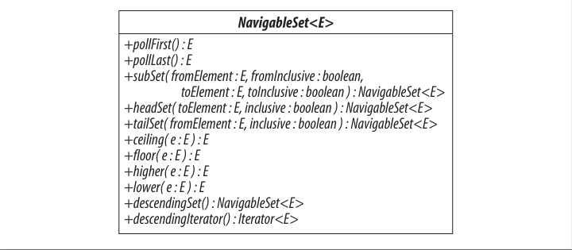
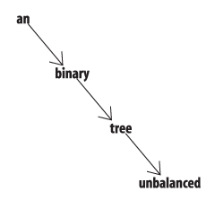
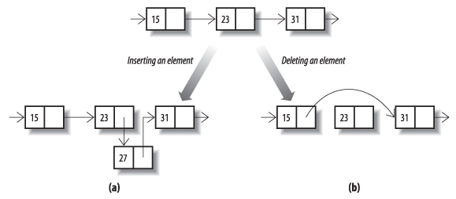

《《《 [返回首页](../README.md)       <br/>
《《《 [上一节](01_Implementing_Set.md)

### SortedSet和NavigableSet

`Set` 有一个子接口 `SortedSet`（图 `13-4`），它向 `Set` 约束添加一个保证，它的迭代器将以升序元素顺序遍历集合。`SortedSet` 本身在接口 `NavigableSet` 的 `Java 6` 中扩展（见图 `13-5` ），它添加了一些方法来查找与目标元素最接近的匹配。`Java 6` 之前的 `SortedSet` 的唯一实现是 `TreeSet`，它已经用实现新接口所需的方法进行了改进。由于在 `Java 6` 中没有实现 `NavigableSet` 的 `SortedSet` 的平台实现，所以在同一部分讨论它们是有意义的。对于为 `Java 6` 平台开发的新客户端代码，根本不需要使用 `SortedSet` 接口，但是为了受限于使用 `Java 5` 的读者，我们将在本节中分别介绍这两个接口的方法。

在第 `3` 章中，我们看到元素排序可以由元素类本身定义，如果它实现了 `Comparable`，或者可以由 `TreeSet` 等构造函数提供的外部比较器来强制执行：

```java
   TreeSet(Comparator<? super E> comparator)
```

`Task` 确实实现了 `Comparable`（它的自然顺序是它的字符串表示的自然顺序），所以我们不需要提供一个单独的比较器。 现在合并两个有序列表，使用并行迭代器非常棘手，如果我们得到一个 `SortedSet` 来完成这项工作，那么这个列表就很简单。 使用例 `12-1` 的任务集合，它需要两行代码：

```java
   Set<Task> naturallyOrderedTasks = new TreeSet<Task>(mondayTasks);
   naturallyOrderedTasks.addAll(tuesdayTasks);
   assert naturallyOrderedTasks.toString().equals ("[code db, code gui, code logic, phone Mike, phone Paul]");
```

虽然这种简单性付出代价，将大小为n的两个排序列表合并为 `O(n)`，但将 `n` 个元素添加到大小为 `n` 的树结构中为 `O(n log n)`。

我们可以使用 `SortedSet` 为待办事项管理器添加一些功能。到现在为止，收集和设置的方法已经给我们排序我们的任务没有任何帮助 - 肯定是待办事项管理者的核心要求之一。例 `13-1` 定义了一个优先级任务的类优先级任务。有三个优先级，`HIGH`，`MEDIUM` 和 `LOW`，被声明为高优先级在自然排序中排在第一位。为了比较两个 `PriorityTasks`，我们首先比较它们的优先级;如果优先级不相等，则优先级较高的任务首先出现，如果优先级相同，则我们使用基本任务的自然排序。为了测试两个 `PriorityTasks` 是否相等，我们检查它们是否具有相同的优先级和相同的任务。这些定义确保自然排序与等号一致（参见第 `3.1` 节）。当我们在 `12.1` 节中定义任务时，我们通过使 `PriorityTask` 不可变来遵循良好的实践。

例 `13-1`。类 `PriorityTask`

```java
   public enum Priority { HIGH, MEDIUM, LOW }
   public final class PriorityTask implements Comparable<PriorityTask> {
     private final Task task;
     private final Priority priority;
     PriorityTask(Task task, Priority priority) {
     this.task = task;
     this.priority = priority;
    }
    public Task getTask() { return task; }
    public Priority getPriority() { return priority; }
    public int compareTo(PriorityTask pt) {
      int c = priority.compareTo(pt.priority);
      return c != 0 ? c : task.compareTo(pt.task);
    }
    public boolean equals(Object o) {
    if (o instanceof PriorityTask) {
      PriorityTask pt = (PriorityTask)o;
      return task.equals(pt.task) && priority.equals(pt.priority);
      } else 
	    return false;
    }
    public int hashCode() { return task.hashCode(); }
    public String toString() { return task + ": " + priority; }
  }
```

下面的代码显示了 `SortedSet` 与一组 `PriorityTasks` 一起工作（事实上，我们已经声明了一个 `NavigableSet`，以便我们可以在后面的示例中使用相同的集合。但是目前，我们将只使用 `SortedSet` 的方法）：

```java
   NavigableSet<PriorityTask> priorityTasks = new TreeSet<PriorityTask>();
   priorityTasks.add(new PriorityTask(mikePhone, Priority.MEDIUM));
   priorityTasks.add(new PriorityTask(paulPhone, Priority.HIGH));
   priorityTasks.add(new PriorityTask(databaseCode, Priority.MEDIUM));
   priorityTasks.add(new PriorityTask(interfaceCode, Priority.LOW));
   assert(priorityTasks.toString()).equals("[phone Paul: HIGH, code db: MEDIUM, phone Mike: MEDIUM, code gui: LOW]");
```

你能否简单地比较任务的优先级，而不使用字符串表示作为辅助键？ 如果您想保留原始排序的某些方面，那么这样的偏序会很有用; 例如，您可能希望按优先级对任务进行排序，但在每个优先级内保留它们添加到该组的顺序。 但是 `SortedSet` 的契约（以及后面将会看到的 `SortedMap`）声明它将使用其比较器的比较方法 - 或者，如果它没有，则它的元素的 `compareTo` 方法 - 而不是元素的 `equals` 方法来确定何时元素是不同的。 这意味着如果多个元素的比较结果相同，则该集合会将它们视为重复对象，除了一个元素之外的所有元素都将被丢弃。

`SortedSet`接口定义的方法分为三组：

**获取第一个和最后一个元素**

```java
   E first() // 返回set里第一个元素
   E last() //  返回set里最后一个元素
```

如果该集合为空，则这些操作会抛出 `NoSuchElementException`。

**检索比较器**


```java
   Comparator<? super E> comparator()
```

如果在施工时已经给出了一个比较器，那么此方法将返回该集合的比较器。 使用 `Comparator<? super E>` 是因为在 `E` 上参数化的 `SortedSet` 可以依赖于在 `E` 的任何超类型上定义的比较器的排序。 例如，回顾第 `3.3` 节，`Comparator<Fruit>` 可以与 `SortedSet<Apple>` 一起使用。

**获取范围视图**

```java
   SortedSet<E> subSet(E fromElement, E toElement)
   SortedSet<E> headSet(E toElement)
   SortedSet<E> tailSet(E fromElement)
```

`subSet` 方法返回一个包含原始集合中大于或等于 `fromElement` 且小于 `toElement` 的每个元素的集合。类似地，方法耳机返回小于 `toElement` 的每个元素，并且 `tailSet` 返回大于或等于 `fromElement` 的每个元素。请注意，这些操作的参数本身不一定是该组的成员。返回的集合是半开放的时间间隔：它们包含 `fromElement` - 当然提供它实际上是集合成员，并且不包含 `toElement`。

在我们的例子中，这些方法可以用于提供 `priorityTasks` 中元素的不同视图。例如，我们可以使用 `headSet` 来获得高端中等优先级任务的视图。要做到这一点，我们需要在任务排序中的所有其他人之前完成一项特殊任务;幸运的是，我们在第 `12.1` 节中为此目的定义了一个类 `EmptyTask`。使用它，很容易提取出现在任何低优先级任务之前的所有任务：

```java
   PriorityTask firstLowPriorityTask = new PriorityTask(new EmptyTask(), Priority.LOW);
   SortedSet<PriorityTask> highAndMediumPriorityTasks = priorityTasks.headSet(firstLowPriorityTask);
   assert highAndMediumPriorityTasks.toString().equals("[phone Paul: HIGH, code db: MEDIUM, phone Mike: MEDIUM]");
```

实际上，因为我们知道具有空细节的任务通常不会发生，所以我们也可以在半开区间中使用一个作为第一个端点：

```java
   PriorityTask firstMediumPriorityTask = new PriorityTask(new EmptyTask(), Priority.MEDIUM);
   SortedSet<PriorityTask> mediumPriorityTasks = priorityTasks.subSet(firstMediumPriorityTask, firstLowPriorityTask);
   assert mediumPriorityTasks.toString().equals("[code db: MEDIUM, phone Mike: MEDIUM]");
```

并非所有的订单都可以如此方便地处理; 例如，假设我们想要处理所有中等优先级任务（包括麦克风电话任务）的集合。 要将该集合定义为半开放间隔，`SortedSet` 的用户将需要构造紧接在 `PriorityTask` 排序中的 `mikePhone` 任务之后的任务，为此，您需要知道在自然中成功“Mike”的字符串 排序是“Mike \ 0”（即，添加了空字符的“Mike”）。 幸运的是，`NavigableSet` 的用户有一个更直观的方式来定义这个集合，就像我们稍后会看到的一样。

请注意，这些操作返回的集合不是独立的集合，而是原始 `SortedSet` 的新视图。 因此，我们可以将元素添加到原始集中，并查看视图中反映的更改：

```java
   PriorityTask logicCodeMedium = new PriorityTask(logicCode, Priority.MEDIUM);
   priorityTasks.add(logicCodeMedium);
   assert mediumPriorityTasks.toString().equals("[code db: MEDIUM, code logic: MEDIUM, phone Mike: MEDIUM]");
```

反过来也适用; 视图中的变化反映在原始集合中：

```java
   mediumPriorityTasks.remove(logicCodeMedium);
   assert priorityTasks.toString().equals("[phone Paul: HIGH, code db: MEDIUM, phone Mike: MEDIUM, code gui: LOW]");
```

为了理解它是如何工作的，可以将所有可能的排列顺序想象成一条线，就像算术中使用的数字线一样。 范围被定义为该行的固定段，而不管哪些值实际上在原始集合中。 因此，在 `SortedSet` 和范围上定义的子集将允许您使用 `SortedSet` 当前位于范围内的任何元素。

### NavigableSet

`NavigableSet`（参见图 `13-5` ）是在 `Java 6` 中引入的，用于补充 `SortedSet` 中的缺陷。 正如我们在本节开头提到的，新客户端代码应该优先于 `SortedSet` 使用它。 它增加了四个组的方法。

**获取第一个和最后一个元素**

```java
   E pollFirst() // 检索并移除第一个（最低）元素，如果此集合为空，则返回null
   E pollLast() // 检索并移除最后一个（最高）元素，如果此集合为空，则返回null
```



图`13-5`。`NavigableSet`

这些类似于 `Deque` 中同名的方法（参见 `14.4` 节），并且有助于支持在需要队列功能的应用程序中使用 `NavigableSet`。 例如，在本节中待办事项管理器的版本中，我们可以通过以下方式从列表中获取最高优先级的任务：准备好执行的任务：

```java
   PriorityTask nextTask = priorityTasks.pollFirst();
   assert nextTask.toString().equals("phone Paul: HIGH");
```

注意虽然 `Deque` 也包含方法 `peekFirst` 和 `peekLast`，它们允许客户端在不删除它的情况下检索元素，但 `NavigableSet` 不需要它们，因为它们的函数已经由从 `SortedSet` 继承的第一个和最后一个方法提供。

**获取范围视图**

```java
   NavigableSet<E> subSet(E fromElement, boolean fromInclusive, E toElement, boolean toInclusive)
   NavigableSet<E> headSet(E toElement, boolean inclusive)
   NavigableSet<E> tailSet(E fromElement, boolean inclusive)
```

该组是对 `SortedSet` 中相同名称的方法的改进，它返回总是包含下限并且不包括较高值的子集。 相比之下，`NavigableSet` 方法允许您为每个边界指定它应该是包含的还是独占的。 这使得定义某些集合的范围视图变得更容易。我们早些时候考虑过包含所有中等优先级任务直到包括（中等优先级）的 `mikePhone` 任务在内的集合。 要使用 `SortedSet` 获得该集合，我们必须使用字符串排序的鲜为人知的技术性将其定义为半开放间隔。 但是 `NavigableSet` 允许我们将它定义为一个闭区间，只需指定上限应该包含在内：

```java
   PriorityTask mikePhoneMedium = new PriorityTask(mikePhone, Priority.MEDIUM);
   NavigableSet closedInterval = priorityTasks.subSet(firstMediumPriorityTask, true, mikePhoneMedium, true);
   assert(closedInterval.toString()).equals("[code db: MEDIUM, phone Mike: MEDIUM]");
```

**获得最接近的值**

```java
   E ceiling(E e) // 返回此集合中的最小元素大于或等于e;如果不存在这样的元素，则返回null
   E floor(E e)   // 返回此集合中最大的元素小于或等于e;如果没有这样的元素，则返回null
   E higher(E e)  // 返回此集合中的最小元素严格大于e，如果不存在这样的元素，则返回null
   E lower(E e)   // 返回此集合中最大的元素严格小于e，如果没有这样的元素，则返回null
```

这些方法对于短距离导航很有用。 例如，假设我们想在一组有序的字符串中查找子集中最后三个由“x-ray”定界的字符串，包括该字符串本身（如果它存在于集合中）。`NavigableSet` 方法使这很简单：

```java
   NavigableSet<String> stringSet = new TreeSet<String>();
   Collections.addAll(stringSet, "abc", "cde", "x-ray" ,"zed");
   String last = stringSet.floor("x-ray");
   assert last.equals("x-ray");
   String secondToLast = last == null ? null : stringSet.lower(last);
   String thirdToLast = secondToLast == null ? null : stringSet.lower(secondToLast);
   assert thirdToLast.equals("abc");
```

请注意，根据集合框架设计的一般趋势，`NavigableSet` 返回空值来表示没有元素，例如，`SortedSet` 的第一个和最后一个方法会抛出 `NoSuchElementException`。 出于这个原因，你应该避免在 `NavigableSets` 中使用空元素，实际上，较新的实现 `ConcurrentSkipListSet` 不允许它们（尽管为了向后兼容，`TreeSet` 必须继续这么做）。

**以颠倒顺序浏览集合**

```java
   NavigableSet<E> descendingSet() // 返回此集合中元素的逆序视图
   Iterator<E> descendingIterator() // 返回一个逆序迭代器
```

该组的方法使得在下降（即反向）排序中遍历 `NavigableSet` 同样简单。 作为一个简单的例子，让我们使用最接近的匹配方法概括上面的例子。 假设我们不是仅仅通过“x射线”找到有序的集合中的最后三个字符串，而是按照降序对该集合中的所有字符串进行迭代：

```java
   NavigableSet<String> headSet = stringSet.headSet(last, true);
   NavigableSet<String> reverseHeadSet = headSet.descendingSet();
   assert reverseHeadSet.toString().equals("[x-ray, cde, abc]");
   String conc = " ";
   for (String s : reverseHeadSet) {
     conc += s + " ";
   }
   assert conc.equals(" x-ray cde abc ");
```


图 `13-6`。一个有序的，平衡的二叉树

如果迭代处理涉及对集合的结构更改，并且正在使用的实现是 `TreeSet`（它具有快速迭代器），那么我们将不得不使用显式迭代器来避免 `ConcurrentModificationException`：

```java
   for (Iterator<String> itr = headSet.descendingIterator(); itr.hasNext(); ) {
     itr.next(); itr.remove();
   }
   assert headSet.isempty();
```

### TreeSet

这是我们已经看到的第一个树实现，所以我们现在应该花一点时间来考虑树与集合框架使用的其他实现类型相比如何执行。

树是您需要为需要快速插入和检索单个元素的应用程序选择的数据结构，但这也需要按排序顺序进行。

例如，假设您希望匹配给定前缀的集合中的所有单词，这是可视化应用程序中的常见要求，其中下拉列表应理想地显示与用户键入的前缀匹配的所有可能元素。哈希表无法按排序顺序返回其元素，并且列表无法通过其内容快速检索其元素，但树可以同时执行这两个操作。

在计算中，树是代表层次结构的分支结构。计算机树从系谱树中借用了很多术语，虽然有一些差异;最重要的是，在计算树中，每个节点只有一个父节点（除了没有的根节点）。在计算中经常使用的一类重要的树是二叉树 - 每个节点最多可以有两个孩子。图13-6显示了一个按照字母顺序包含这个句子的单词的二叉树的例子。



图 `13-7`。 一个不平衡的二叉树

如果您查看任何非叶节点（例如，包含以下单词的节点），则可以看到此树的最重要属性：左侧下方的所有节点都包含按字母顺序排列的单词，右侧的所有单词随之而来。要找到一个单词，您需要逐级开始，逐级下降，在每个级别进行字母比较，因此检索或插入元素的成本与树的深度成正比。

那么，含有 `n` 个元素的树有多深？具有两个级别的完整二叉树具有三个元素（即 `2^2 -1`），并且具有三个级别的元素具有七个元素（`2^3 -1`）。通常，具有 `n` 个完整级别的二叉树将具有 `2^n -1`个元素。因此，具有 `n` 个元素的树的深度将以 `log n` 为界（因为 `2^log n = n`）。就像 `n` 的增长速度比 `2^n` 慢得多，`log n` 的增长速度比 `n` 慢得多。所以包含在一棵大树上比在包含相同元素的列表上快得多。它仍然不如散列表 - 它的操作理想情况下可以在不变的时间内工作 - 但是树比散列表有更大的优势，它的迭代器可以按排序顺序返回其元素。

不过，并不是所有的二叉树都会有这么好的表现。图 `13-6` 显示了一个平衡二叉树 - 其中每个节点在每边有相同数量的后代（或尽可能接近）。不平衡的树可能会导致更糟的性能 - 在最坏的情况下，与链表一样差（参见图 `13-7`）。`TreeSet` 使用一种称为红黑树的数据类型，其优点是，如果通过插入或移除元素而导致其不平衡，则可以始终在 `O(log n)`时间内重新平衡它。

`TreeSet` 的构造函数除了标准的构造函数之外，还包括允许您提供比较器（参见第 `3.4` 节）的构造函数和允许您从另一个 `SortedSet` 创建一个的构造函数：

```java
   TreeSet(Comparator<? super E> c) // 构造一个空集，它将使用指定的比较器进行排序
   TreeSet(SortedSet<E> s) // 构造一个包含所提供集合的元素的新集合，按照相同的顺序排序
```

其中的第二个在向标准“转换构造函数”的声明中相当接近（见第 `12.3` 节）：

```java
   TreeSet(Collection<? extends E> c)
```

正如 `Joshua Bloch` 在 `Effective Java` 中所解释的那样（在 `Methods` 的章节中，项目“审慎地使用重载”），调用两个构造函数或方法重载中的一个，这些重载使用相关类型的参数会导致令人困惑的结果。 这是因为，在 `Java` 中，调用重载的构造函数和方法是在编译时根据参数的静态类型来解析的，因此将一个强制类型转换为参数会对调用的结果产生很大的影响，因为 以下代码显示：

```java
   // 构造并填充一个NavigableSet，其迭代器按照自然顺序的相反返回其元素：
   NavigableSet<String> base = new TreeSet<String>(Collections.reverseOrder());
   Collections.addAll(base, "b", "a", "c");
   // 为TreeSet调用两个不同的构造函数，提供刚刚构建的集合，但使用不同的静态类型：
   NavigableSet<String> sortedSet1 = new TreeSet<String>((Set<String>)base);
   NavigableSet<String> sortedSet2 = new TreeSet<String>(base);
   // 并且这两组具有不同的迭代次序：
   List<String> forward = new ArrayList<String>();
   forward.addAll(sortedSet1);
   List<String> backward = new ArrayList<String>();
   backward.addAll(sortedSet2);
   assert !forward.equals(backward);
   Collections.reverse(forward);
   assert forward.equals(backward);
```

此问题折磨框架中所有已排序集合的构造函数（`TreeSet`，`TreeMap`，`ConcurrentSkipListSet` 和 `ConcurrentSkipListMap`）。为了避免出现在你自己的类设计中，为不同的重载选择参数类型，以便适合于一个重载的参数类型不能转换为适合不同类型的参数类型。如果这是不可能的，则应该将这两个重载设计为与同一个参数具有相同的行为，而不管其静态类型如何。例如，从集合构造的 `PriorityQueue`（第 `14.2.1` 节）使用原始的顺序，无论构造函数提供的静态类型是包含 `Comparator` 的类型 `PriorityQueue` 或 `SortedSet` 之一，还是纯粹的 `Collection`。为了达到这个目的，转换构造函数使用提供的集合的比较器，如果它没有自然顺序的话，它只会退化。

`TreeSet` 是不同步的并且不是线程安全的;它的迭代器是快速失败的。

### ConcurrentSkipListSet



图 `13-8`。 修改链接列表


图 `13-9`。 搜索跳过列表

`ConcurrentSkipListSet` 作为第一个并发集合实现在 `Java 6` 中引入。它由跳过列表支持，跳过列表是上一节二叉树的现代替代方案。一个集合的跳过列表是一系列链表，每个链表都是由两个字段组成的一连串单元格：一个用于保存一个值，另一个用于保存对下一个单元格的引用。通过指针重新排列，元素在常量时间内插入和移出链表，如图 `13-8` 部分（`a`）和（`b`）所示。

图 `13-9` 显示了一个由三个链接列表组成的链接列表，标记为级别 `0`,`1` 和 `2`.集合的第一个链接列表（图中的级别 `0`）包含集合的元素，根据其自然顺序排序或由该组的比较器。 `0` 级以上的每个列表包含下面列表的一个子集，根据固定的概率随机选择。对于这个例子，我们假设概率是 `0.5` ;平均而言，每个列表将包含它下面列表的一半元素。在链接之间进行浏览需要一段固定的时间，因此找到一个元素最快的方法是从顶部列表的开头（左侧）开始，并尽可能远离每个列表，然后放到下面的列表中。

图 `13-9` 的曲线箭头表示搜索元素 `55` 的进程。搜索从级别 `2` 的左上角的元素 `12` 开始，在该级别上步进到元素 `31`，然后发现下一个元素是 `61`，高于搜索值。所以它下降一个级别，然后重复这个过程;元素 `47` 仍然小于 `55`，但是 `61` 又是太大了，所以它再次下降一个级别并且在一个进一步的步骤中找到搜索值。将元素插入到跳过列表中总是涉及至少将其插入到级别 `0`.当已经完成了，是否也应该插入第 `1` 级？如果 `1` 级平均包含 `0` 级元素的一半，那么我们应该抛硬币（也就是随机选择 `0.5` 的概率）来决定是否应该插入 `1` 级。如果掷硬币导致它被插入到第 `1` 级，那么该过程将重复第 `2` 级，等等。要从跳过列表中删除元素，它将从其出现的每个级别中删除。

如果抛硬币变得糟糕，我们最终可能会列出 `0` 以上的每个列表空白或满的情况，这同样会很糟糕。然而，这些结果的可能性非常低，分析表明，实际上，跳过列表的性能可以与二叉树相媲美：搜索，插入和删除都会花费 `O(log n)`。它们的并发使用的强大优势是它们具有高效的无锁插入和删除算法，而没有二叉树的已知方法。

`ConcurrentSkipListSet` 的迭代器是弱一致的。

表 `13-1`。不同 `Set` 实现的比较性能

   集合 | add     | contains   | next     | notes 
 ---|---      | ---        | ---      | ---   
   HashSet                  |O(1)     | O(1)       |O(h/n)    | h是表格容量
   LinkedHashSet            |O(1)     | O(1) O(1)  |          | 
   CopyOnWriteArraySet      |O(n)     | O(n) O(1)  | 	      | 
   EnumSet                  |O(1)     | O(1) O(1)  |          | 
   TreeSet                  |O(log n) | O(log n)   |O(log n)  |
   ConcurrentSkipListSet    |O(log n) | O(log n)   |O(1)      |

在 `EnumSet` 实现中，对于多于 `64` 个值的枚举类型，下一个最坏情况下的复杂度为 `O(log m)`，其中 `m` 是枚举中元素的数量。

《《《 [下一节](../ch14/00_Queues.md)      <br/>
《《《 [返回首页](../README.md)