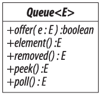
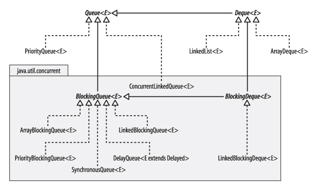

# Queues

队列是一个集合，用于保存要处理的元素，并按照它们要处理的顺序生成它们。相应的集合框架接口队列（参见图 `14-1`）有许多不同的实现，它们体现了关于这个顺序应该是什么的不同规则。许多实现使用的规则是按照提交顺序处理任务（先进先出或 `FIFO`），但也可以使用其他规则 - 例如，集合框架包括处理顺序为基于任务优先级。`Queue` 接口是在 `Java 5` 中引入的，部分原因是该版本中包含的并发实用程序中需要队列。看一下图 `14-2` 所示的实现层次结构，事实上，集合框架中几乎所有的 `Queue` 实现都在 `java.util.concurrent` 包中。

并发系统中的队列的一个经典要求是当许多任务必须由多个并行工作的线程执行时。这种情况的一个日常例子是由一组登机运营商处理的单个航班乘客队列。每个操作员在处理单个乘客（或一组乘客）时工作，而剩余的乘客在队列中等待。当他们到达时，乘客加入队列的尾部，等到他们的头部，然后被分配给下一个空闲的运营商。实现这样的队列涉及到很多细节，必须防止运营商同时尝试处理同一名乘客，空队列必须得到正确处理，并且在计算机系统中必须有一种定义具有最大尺寸或界限的队列的方法。（这最后一项要求可能不会在航空公司终端中强制执行，但对于执行任务需要最长等待时间的系统来说，它可能非常有用。）`java.util.concurrent` 中的 `Queue` 实现将关注这些实现。

除了继承自 `Collection` 的操作之外，队列接口还包括将元素添加到队列尾部，在其头部检查元素或在其头部删除元素的操作。这三个操作中的每一个都有两种类型，一种返回一个值来表示失败，另一种抛出异常。



图 `14-1`。 队列



图 `14-2`。 集合框架中队列的实现

**将元素添加到队列**此操作的异常抛出变体是从 `Collection` 继承的 `add` 方法。 虽然 `add` 不返回一个布尔值，表示它在插入元素方面的成功，但该值不能用于报告有界队列已满;`add` 的合约指定它只有在集合因为它已经存在而拒绝该元素时才会返回 `false`，否则它必须抛出异常。

价值回归变体是提供：

```java
   boolean offer (E e) // 如果可能的话插入给定的元素
```

`offer` 返回的值表示元素是否被成功插入。 请注意，如果元素在某些方面非法（例如，不允许 `null` 的队列的值为 `null`），`offer` 会抛出异常。 通常情况下，如果报价返回 `false`，则在已达到容量的有界队列上调用该报价。

**从队列中检索元素**此组中的方法是 `peek` 和元素，用于检查 `head` 元素，以及 `poll` 和 `remove` 以将其从队列中移除并返回其值。

引发空队列异常的方法是：

```java
   E element() // 检索但不要删除头元素
   E remove()  // 检索并移除头部元素
```

请注意，这是与 `Collection` 方法 `remove(Object)` 不同的方法。 对于空队列返回 `null` 的方法是：

```java
   E peek() // 检索但不要删除头元素
   E poll() // 检索并移除头部元素
```

由于这些方法返回 `null` 以表示队列为空，因此应避免将 `null` 用作队列元素。 通常，`Queue` 接口不鼓励使用 `null` 作为队列元素，并且允许它的唯一标准实现是传统实现 `LinkedList`。


