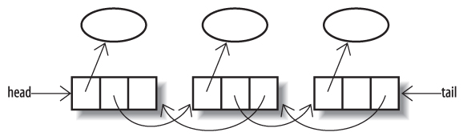

## Deque

`deque`（发音为“deck”）是一个双端队列。与只能在尾部插入元素并仅在头部进行检查或删除的队列不同，`deque` 可以接受用于插入的元素并将其呈现在任一端进行检查或删除。与 `Queue` 不同的是，`Deque` 的合约指定了它在呈现元素时使用的顺序：它是一种线性结构，其中在尾部添加的元素在头部以相同的顺序排列。用作队列，那么 `Deque` 总是一个 `FIFO` 结构;合同不允许优先考虑。如果从添加元素的同一端（头部或尾部）删除元素，则 `Deque` 将用作堆栈或 `LIFO`（后进先出）结构。

`Deque` 及其子接口 `BlockingDeque` 在 `Java 6` 中引入。快速 `Deque` 实现 `ArrayDeque` 使用循环数组（请参见第 `14.3.2` 节），现在是堆栈和队列的选择实现。并发 `deques` 在并行化中扮演着特殊的角色，在第 `14.4.2` 节讨论。

`Deque` 接口（参见图 `14-7` ）使用关于头部和尾部对称的方法扩展队列。为了明确命名，隐式引用队列一端的 `Queue` 方法获取一个同义词，使其行为对 `Deque` 是显式的。例如，从 `Queue` 继承的方法 `peek` 和 `offer`，等同于 `peekFirst` 和 `offerLast`。（第一个和最后一个是指 `deque` 的头部和尾部; `Deque` 的 `JavaDoc` 也使用“front”和“end”。）


图 14-7. Deque

### 集合方法

```java
   void addFirst(E e) // 如果有足够的空间，将e插入头部
   void addLast(E e)  // 如果有足够的空间，请在尾部插入e
   void push(E e)     // 如果有足够的空间，将e插入头部
   boolean removeFirstOccurrence(Object o); // 删除第一个出现的o
   boolean removeLastOccurrence(Object o);  // 删除最后一次出现的o
   Iterator<E> descendingIterator() // 得到一个迭代器，以相反的顺序返回deque元素
```

`addFirst` 和 `addLast` 方法的约定与 `Collection` 的 `add` 方法的约定类似，但另外指定要添加的元素的位置，如果不能添加，则引发的异常为 `IllegalStateException`。与有界队列一样，有界 `deques` 的用户应该避免使用这些方法来支持 `offerFirst` 和 `offerLast`，它可以通过返回的布尔值报告“正常”失败。

方法名称 `push` 是 `addFirst` 的同义词，用于将 `Deque` 用作堆栈。 `removeFirstOccurrence` 和 `removeLastOccurrence` 是类似于 `Collection.remove` 的类似方法，但还要指定哪些元素应该被删除。 返回值表示元素是否因调用而被删除。

### 队列方法

```java
   boolean offerFirst(E e) // 如果这个deque有空间，就在头部插入e
   boolean offerLast(E e)  // 如果deque有空间，请在尾部插入e
```

方法 `offerLast` 是 `Queue` 接口上等效方法报价的重命名。

对于空双端队列返回 `null` 的方法是：

```java
   E peekFirst() // 检索但不要删除第一个元素
   E peekLast()  // 检索但不删除最后一个元素
   E pollFirst() // 检索并删除第一个元素
   E pollLast()  // 检索并删除最后一个元素
```

`peekFirst` 和 `pollFirst` 方法是队列接口上等价方法 `peek` 和 `poll` 的重命名。

为空双端队列引发异常的方法是：

```java
   E getFirst()     // 检索但不要删除第一个元素
   E getLast()      // 检索但不删除最后一个元素
   E removeFirst()  // 检索并删除第一个元素
   E removeLast()   // 检索并删除最后一个元素
   E pop()          // 检索并删除第一个元素
```

方法 `getFirst` 和 `removeFirst` 是等效方法元素的重命名并在队列接口上删除。 方法名pop是一个同义词，用于删除首先，再次提供了栈的使用。

#### 实现Deque

#### ArrayDeque

除了接口 `Deque` 之外，`Java 6` 还引入了一个非常高效的实现 `ArrayDeque`，它基于像 `ArrayBlockingQueue` 这样的循环数组（参见 `14.3.2` 节）。 它填补了 `Queue` 类之间的空白。 以前，如果您希望在单线程环境中使用 `FIFO` 队列，您将不得不使用类 `LinkedList`（我们将在后面介绍，但应该避免将其作为通用 `Queue` 实现），或者支付 使用并发类 `ArrayBlockingQueue` 或 `LinkedBlockingQueue` 之一的线程安全不必要的开销。对于 `deques` 和 `FIFO` 队列，`ArrayDeque` 现在是选择的通用实现。 它具有圆形阵列的性能特征：在头部或尾部添加或移除元素需要一段时间。 迭代器快速失败。

#### LinkedList



图 `14-8`. 一个双向链表

在 `Deque` 实现中，`LinkedList` 是一个古怪的东西;例如，单独允许 `null` 元素，`Queue` 接口不鼓励使用空元素，因为 `null` 通常用作特殊值。它从一开始就一直处于集合框架中，最初是作为 `List` 的标准实现之一（参见第 `15.2` 节），并且用 `Queue for Java 5` 的方法和 `Deque for Java 6` 的方法进行了改进。它基于一个链表结构类似于我们在 `13.2.3` 节中看到的链表结构作为跳过列表的基础，但是在每个单元中有一个额外的字段，指向前一个条目（见图 `14-8` ）。这些指针允许列表向后遍历 - 例如，用于反向迭代，或者从列表的末尾删除元素。

作为 `Deque` 的一个实现，`LinkedList` 不太可能非常流行。它的主要优点，即恒定时间的插入和删除，在 `Java 6` 中可以与队列和 `deques` 相媲美 - 由其他更高级的 `ArrayDeque` 所支持。以前，如果线程安全不是问题，并且不需要阻止行为，那么您就可以使用它。现在，将 `LinkedList` 用作队列或deque实现的唯一可能原因是您还需要随机访问要素。有了 `LinkedList`，即使这样做价格也很高;由于随机访问必须通过线性搜索来实现，因此其时间复杂度为 `O(n)`。

`LinkedList` 的构造函数只是第 `12.3` 节中的标准函数。它的迭代器快速失败。

### BlockingDeque

图 `14-9` 显示了 `BlockingDeque` 添加到 `BlockingQueue` 的方法（请参见图 `14-5`）。`BlockingQueue` 的两个阻塞插入方法和两个删除方法都有一个同义词，用于明确它所修饰的 `deque` 的哪一端，以及匹配方法以在另一端提供相同的动作。 因此，报价，例如，获取同义词 `offerLast` 和匹配方法报价首先。 因此，为 `BlockingQueue` 定义的相同的四个基本行为 - 在失败时返回一个特殊值，在超时后返回失败时的特殊值，在失败时抛出异常并阻塞直到成功 - 可以应用于元素插入或 在 `deque` 的任一端去除。


图 `14-9`. BlockingDeque

随着多核和多处理器架构成为标准，良好的负载平衡算法将变得越来越重要。并发 `deques` 是最好的负载平衡方法之一，盗窃工作的基础。为了理解窃取工作，设想一种负载平衡算法，它以某种方式分配任务 - 循环 - 比如说 - 一系列队列，每个队列都有一个专用的消费者线程，可以从队列的头部重复执行任务，处理它，并返回另一个。尽管这种方案确实通过并行提供了加速，但它有一个主要缺点：我们可以想象两个相邻的队列，一个长期任务积压和一个消费者线程努力跟上它们，并且在它旁边有一个空闲空闲队列消费者等待工作。如果我们允许空闲线程从另一个队列的头部执行任务，它将明显提高吞吐量。工作窃取进一步提高了这个想法;观察到空闲线程从另一个队列的头部窃取工作会冒险争夺头元素，它会更改队列中的队列并指示空闲线程从另一个线程的双端队列的尾部执行任务。事实证明这是一种高效的机制，并且正在被广泛使用。

#### 实现BlockingDeque

接口 `BlockingDeque` 具有单个实现 `LinkedBlockingDeque`。`LinkedBlockingDeque` 基于类似 `LinkedList` 的双链表结构。除了两个标准构造函数之外，它可以有选择地被限制，它提供了第三个可以用来指定其容量的第三个构造函数：

```java
   LinkedBlockingDeque(int capacity)
```

它具有与 `LinkedBlockingQueue` 类似的性能特征 - 队列插入和删除需要不断的时间和操作，比如包含需要遍历队列的操作，需要线性时间。迭代器是弱一致的。

