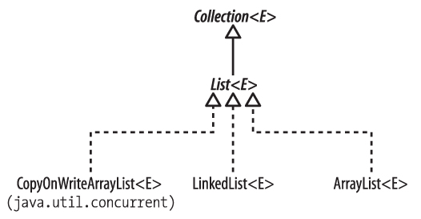
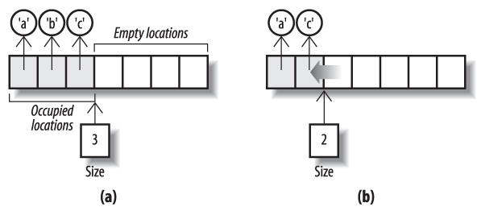

《《《 [返回首页](../README.md)       <br/>
《《《 [上一节](01_Using_the_Methods_of_List.md)

### 实现 List

在集合框架中有三个具体的 `List` 实现（参见图 `15-3`），它们执行界面定义的各种操作的速度以及它们在并发修改时的行为方式有所不同; 但是，与 `Set` 和 
`Queue` 不同，`List` 没有子接口来指定功能行为的差异。 在本节和下一节中，我们依次查看每个实现并提供性能比较。



图 `15-3` `List`接口的实现

#### ArrayList

数组作为 `Java` 语言的一部分提供，并且语法非常方便，但是它们的关键缺点 - 一旦创建，它们不能调整大小 - 使它们不如 `List` 实现更受欢迎，它们（如果可
调整大小）是无限可扩展的。实际上，`List` 最常用的实现是 `ArrayList`，即一个由数组支持的 `List`。

`ArrayList` 的标准实现将 `List` 元素存储在连续的数组位置中，第一个元素始终存储在数组中的索引 `0` 处。它需要一个至少足够大（有足够容量）的数组来容纳
这些元素，以及一种跟踪“占用”位置数量（列表大小）的方法。如果一个 `ArrayList` 已经增长到了它的大小等于它的容量的地步，试图添加另一个元素将需要它用一
个能够容纳旧内容和新元素的较大容器替换后备数组，进一步扩展（标准实现实际上使用了一个新的数组，它是旧数组的两倍）。正如我们在第 `11.3` 节中解释的那
样，这导致 `O(1)` 的摊销成本。

`ArrayList` 的性能反映了“随机访问”操作的数组性能：`set` 和 `get` 获取常量时间。数组实现的缺点是在任意位置插入或移除元素，因为这可能需要调整其他元素
的位置。 我们已经用基于数组的队列的迭代器的 `remove` 方法来解决这个问题 - 例如，`ArrayBlockingQueue`（见 `14.3.2` 节）。但是对于列表来说位置添加
和移除方法的性能比迭代器更重要.`remove` 是为队列。）

例如，图 `15-4`（`a`）通过以下语句添加了三个元素后显示了一个新的 `ArrayList`：

```java
List<Character>; charList = new ArrayList<Character>();
Collections.addAll(charList, 'a', 'b', 'c');
```

如果我们现在想要移除数组的索引 `1` 处的元素，那么实现必须保留剩余元素的顺序并确保数组的占用区域仍然从索引 `0` 开始。因此索引2处的元素必须是 移至索引 
`1`，索引 `3` 移至索引 `2`，依此类推。图 `15-4`（`b`）显示了这个操作执行后的样本 `ArrayList`。 由于每个元素都必须依次移动，因此此操作的时间复杂度
与列表的大小成正比（即使由于此操作通常可以用硬件实现，常数因子很低）。



图 `15-4`。 从 `ArrayList` 中移除元素

即便如此，提醒读者回顾了用于实现 `ArrayBlockingQueue` 和 `ArrayDeque`（参见 `14.4.1` 节）的循环数组的讨论可能会想知道为什么还没有选择循环数组来实
现 `ArrayList`。确实，循环数组的添加和删除方法只有在索引参数为0时才会显示出更好的性能，但这是一个常见的情况，并且使用循环数组的开销非常小，以至于问
题依旧。

事实上，`Heinz Kabutz` 在 [`The Java Specialists'Newsletter`](http://www.javaspecialists.co.za/archive/Issue027.html) 中提出了一个循环数组
列表的大纲实现。原则上，仍然有可能的 `ArrayList` 可以通过这种方式来重新实现，这可能导致许多现有的 `Java applications.A` 可能的替代真正的性能提升是
圆形 `ArrayDeque` 可改进来实现列表的方法。与此同时，如果您的应用程序使用 `List`，其中从列表开始的元素插入和删除的性能比 `randomaccess` 操作的性能
更重要，请考虑写入 `Deque` 接口并利用其非常高效的 `ArrayDeque` 实现。

正如我们在讨论 `ArrayBlockingQueue`（第 `14.2` 节）时所提到的，可变大小的数组支持的集合类可以有一个配置参数：数组的初始长度。因此，除了标准集合框架
构造函数之外，`ArrayList` 还有一个允许您选择初始容量的值足够大以容纳集合的元素，而无需频繁的创建 - 复制操作。由默认构造函数创建的 `ArrayList` 的初
始容量为 `10`，使用另一个集合的元素初始化的初始容量是该集合大小的 `110％`。

`ArrayList` 的迭代器是快速失败的。

#### LinkedList

我们在 `14.4.1` 节中讨论了 `LinkedList` 作为 `Deque` 实现。 如果您的应用程序大量使用随机访问，您将避免它作为 `List` 实现; 由于列表必须在内部进行
迭代以达到所需的位置，位置添加和移除平均具有线性时间复杂度。 其中 `LinkedList` 确实比 `ArrayList` 具有更好的性能优势，它可以添加和移除列表末尾以外
的任何元素; 对于 `LinkedList`，这需要一段时间，而非非圆形数组实现所需的线性时间。

#### CopyOnWriteArrayList

在第 `13.1` 节中，我们遇到了 `CopyOnWriteArraySet`，这是一个集合实现，旨在提供线程安全性以及非常快速的读取访问。`CopyOnWriteArrayList` 是一个具
有相同设计目标的 `List` 实现。线程安全与快速读取访问的组合对于某些并发程序非常有用，尤其是当观察者对象的集合需要接收频繁的事件通知时。成本是支持集合
的数组必须被视为不可变的，所以每当对集合进行任何更改时都会创建一个新副本。如果观察员组的变化很少发生，这个成本可能不会太高。

`CopyOnWriteArraySet` 类实际上将其所有操作委托给 `CopyOnWriteArrayList` 实例，利用后者提供的原子操作 `addIfAbsent` 和 `addAllAbsent` 来启用 
`Set` 方法 `add` 和 `addAll`，以避免向该集合中引入重复项。除了两个标准的构造函数（参见 `12.3` 节）之外，`CopyOnWriteArrayList` 还有一个允许使用
提供的数组元素作为其初始内容创建的额外元素。它的迭代器是快照迭代器，反映了它们创建时的列表状态。

《《《 [下一节](03_Comparing_List_Implementations.md)      <br/>
《《《 [返回首页](../README.md)
