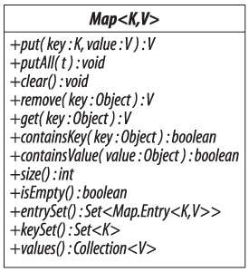

《《《 [返回首页](../README.md)       <br/>
《《《 [上一节](../ch15/03_Comparing_List_Implementations.md)

## Maps

`Map` 接口是主要集合框架接口中的最后一个，也是唯一不能从 `Collection` 继承的接口。 它定义了一组键值对关联所支持的操作，其中键是唯一的。 这些操作如图 `16-1` 所示，分为以下四组，大致平行于 `Collection-adding` 元素的四个操作组，删除元素，查询集合内容以及提供集合内容的不同视图。

**添加关联**

```java
   V put(K key, V value) // 如果密钥存在，则添加或替换键值关联返回旧值（可能为空）; 否则返回null
   void putAll(Map<? extends K,? extends V> m) // 将提供的映射中的每个键值关联添加到接收器中
```

该组中的操作是可选的; 在不可修改的映射上调用它们将导致 `UnsupportedOperationException`。

**删除关联**

```java
   void clear() // 从此地图中删除所有关联
   V remove(Object key) // 使用给定的密钥去除关联（如果有的话）; 返回与其关联的值，或返回null
```

`Map.remove` 的签名与 `Collection.remove` 的签名相似（请参阅第 `12.1` 节），因为它采用 `Object` 类型的参数而不是泛型类型。 我们讨论过了 `2.6` 节中的这个设计的替代方案。

像前一组的添加操作一样，这些删除操作是可选的。

**查询 Map 的内容**

```java
   V get(Object k) // 返回对应于k的值;如果k不存在，则返回null
   boolean containsKey(Object k) // 如果k作为键存在，则返回true
   boolean containsValue(Object v) // 如果v作为值存在，则返回true
   int size() // 返回关联的数量
   boolean isEmpty() // 如果没有关联，则返回true
```



图 `16-1` `Map`

对于允许空键或值（分别）的 `Map` 实现，`containsKey` 和 `containsValue` 的参数可能为 `null`。 如果为这些方法提供了 `null` 参数，则不允许为 `null` 的实现将抛出 `NullPointerException`。

与 `Collection` 的 `size` 方法一样，可以报告的最大元素数量是 `Integer.MAX_VALUE`。

提供键，值或关联的集合视图：

```java
   Set<Map.Entry<K, V>> entrySet() // 返回关联的Set视图
   Set<K> keySet() // 返回键的Set视图
   Collection<V> values() // 返回值的集合视图
```

这些方法返回的集合由地图支持，因此对地图的任何更改都会反映在地图本身中，反之亦然。事实上，通过视图只能进行有限的更改：可以直接或通过视图上的迭代器删除元素，但不能添加元素;如果你尝试，你会得到一个 `UnsupportedOperationException`。删除键可删除单个相应的键值关联;另一方面，删除值只会删除映射到其中的一个关联;该值可能仍然作为与不同密钥关联的一部分存在。如果支持地图被同时修改，则视图上的迭代器将变为未定义。

`entrySet` 返回的集合的成员实现了接口 `Map.Entry`，它表示键值关联并提供了一个 `setValue` 方法，可用于更改备份映射中的值。`Map.Entry` 的文档在指定实现接口的对象时只能在通过 `entrySet` 调用产生的视图迭代期间创建，并且如果在此迭代过程中修改了支持映射，则这些对象变为无效。在 `Java 6` 中，创建 `Map.Entry` 对象的这种限制性方案不够充分，因为它是 `NavigableMap` 的许多方法的返回类型（请参见第 `16.3` 节）。

《《《 [下一节](01_Using_the_Methods_of_Map.md)      <br/>
《《《 [返回首页](../README.md)


