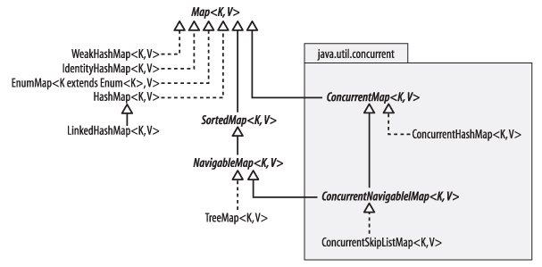

《《《 [返回首页](../README.md)       <br/>
《《《 [上一节](01_Using_the_Methods_of_Map.md)

### 实现Map

图 `16-2` 显示了集合框架为 `Map` 提供的实现，共八个实例。 我们将在这里讨论 `HashMap`，`LinkedHashMap`，`WeakHashMap`，`IdentityHashMap` 和 
`EnumMap`; 讨论 `NavigableMap`，`ConcurrentMap` 和 `ConcurrentNavigableMap` 的接口及其实现，以下部分。

对于构造函数，`Map` 实现的一般规则类似于 `Collection` 实现（参见 `12.3` 节）。 除 `EnumMap` 以外的每个实现都至少有两个构造函数; 以 `HashMap` 为
例，它们是：

```java
public HashMap()
public HashMap(Map<? extends K,? extends V> m)
```

其中第一个创建一个空映射，第二个映射将包含提供的映射 `m` 中包含的键 - 值映射。 `map m`的键和值必须具有与正在创建的映射的键和值分别相同（或者是其子类
型）的类型。 使用第二个构造函数与使用默认构造函数创建空映射的效果相同，然后使用 `putAll` 添加 `map m` 的内容。 除了这两者之外，标准实现还有其他用于
配置目的的构造函数。



图 `16-2`。 集合框架中 `Map` 实现的结构

### HashMap

在讨论第 `13.1.1` 节中的 `HashSet` 时，我们提到它将其所有操作委托给 `HashMap` 的私有实例。图 `16-3`（`a`）与图 `13-2` 类似，但没有从映射中移除值
元素的简化（`HashSet` 中的所有元素都以具有相同常数值的键存储）。哈希表第 `13.1` 节中的讨论及其性能同样适用于 `HashMap`。特别是，`HashMap` 为 
`put` 和 `get` 提供了恒定的性能。尽管原则上恒定时间的性能只能在没有碰撞的情况下实现，但可以通过使用重新哈希来控制负载并由此最小化碰撞次数来紧密接近
它。

对键或值的集合进行迭代需要的时间与映射的容量加上包含的键 - 值映射的数量成正比。迭代器快速失败。

两个构造函数允许程序员配置一个新的 `HashMap` 实例：

```java
public HashMap(int initialCapacity)
public HashMap(int initialCapacity, float loadFactor)
```

这些构造函数与 `HashSet` 的构造函数类似，允许指定初始容量，并且可选地指定表将被重新映射的加载因子。

### LinkedHashMap


图 `16-3`.`HashMap` 和 `WeakHashMap`

像 `LinkedHashSet`（ `13.1.2` 节）一样，类 `LinkedHashMap` 通过保证迭代器返回其元素的顺序来优化其父类 `HashMap` 的约定。但是，与 
`LinkedHashSet` 不同，`LinkedHashMap` 提供迭代次序的选择; 元素可以按照它们在地图中插入的顺序或按照它们的访问顺序（从最近到最近访问的顺序）返回。访
问顺序 `LinkedHashMap` 是通过提供 `true` 的参数 构造函数的最后一个参数：

```java
public LinkedHashMap(int initialCapacity,
float loadFactor,
boolean accessOrder)
```

提供 `false` 将提供插入顺序的地图。其他的构造函数，就像 `HashMap` 的构造函数一样，也生成插入顺序的地图。与 `LinkedHashSet` 一样，迭代 
`LinkedHashMap` 所需的时间只与地图中元素的数量成正比，而不是其容量。

访问顺序映射对于构建最近最少使用（`LRU`）缓存特别有用。高速缓存是存储经常访问的数据以便快速访问的内存区域。在设计高速缓存时，关键问题是选择哪种算法来
决定要删除哪些数据以节省内存。当需要找到来自缓存数据集的项目时，将首先搜索缓存。通常，如果在高速缓存中找不到该项目，则会从主存储中检索该项目并将其添
加到高速缓存中。但是不能允许缓存继续无限增长，因此必须选择一种策略，以便在添加新缓存时从缓存中删除最不有用的项目。如果选择的策略是LRU，则删除的条目将
是最近使用的条目。这种简单的策略适用于元素的访问增加了在相同元素的近期进一步访问的可能性的情况。它的简单性和速度使其成为最受欢迎的缓存策略。

使用 `LinkedHashMap` 进行缓存构建可以通过 `removeEldestEntry` 进一步辅助，它是从 `HashMap` 继承的单一方法

```java
protected boolean removeEldestEntry(Map.Entry<K,V> eldest)
```

`removeEldestEntry` 的合约规定，只要向地图添加新条目，`put` 和 `putAll` 方法就会调用 `removeEldestEntry`，并将“最老”条目传递给它。在插入顺序的地
图中，最年长的条目将是最近最少添加到地图的条目，但在访问顺序映射中，它是最近最少访问的映射（如果某些条目从未访问过，则是其中最近最少添加的这些之
一）。在 `LinkedHashMap` 本身中，`removeEldestEntry` 不做任何事情并返回 `false`，但是子类可以覆盖它以在某些情况下返回 `true`。此方法的契约指定虽
然它本身可以移除最老的条目，但如果它已经这样做，它必须返回 `false`，因为预计 `true` 的返回值将导致其调用方法执行删除操作。`removeEldestEntry` 的一
个简单示例将允许地图增长到给定的最大大小，然后通过在每次添加新地图时删除最老的条目来保持该大小：

```java
class BoundedSizeMap extends LinkedHashMap {
  private int maxEntries;
  public BoundedSizeMap(int maxEntries) {
    super(16, 0.75f, true);
    this.maxEntries = maxEntries;
  }
  protected boolean removeEldestEntry(Map.Entry eldest) {
    return size() > maxEntries;
  }
}
```

这个简单示例的改进可以考虑作为 `removeEldestEntry` 的参数提供的条目。 例如，目录高速缓存可能有一组保留名称，即使缓存继续增长，也不应删除该名称。

请注意，如上所示重写 `removeEldestEntry` 的插入顺序 `LinkedHashMap` 将实现 `FIFO` 策略。`FIFO` 缓存通常优先于 `LRU` 使用，因为在不提供访问顺序的
地图中实现起来要简单得多。 然而，`LRU` 通常比 `FIFO` 更有效，因为缓存刷新的成本降低超过维护访问排序的开销。

对 `LinkedHashMap` 返回的键或值的集合的迭代在元素数量上是线性的。这些集合上的迭代器快速失败。

### WeakHashMap

一个普通的 `Map` 保持对它所包含的所有对象的普通（“强”）引用。这意味着，即使通过地图本身以外的任何方式都无法获得密钥，也无法收集垃圾。通常，这正是我们
想要的;在本章开头的示例中，我们将任务映射到客户端，我们不希望映射消失，仅仅是因为我们没有持有对我们放入 `HashMap` 的任务对象的引用。要查找与提供的键
相关联的值，`HashMap` 将查找与提供的键相匹配的键（在等同意义上） - 它们不必是物理上相同的对象。

但是，假设关键类的对象是唯一的 - 即对象相等与对象标识相同。例如，每个对象可能包含一个唯一的序列号。在这种情况下，一旦我们不再有一个从 `Map` 之外引用
的对象 - 被用作关键字的对象，我们再也不能查看它了，因为我们永远无法重新创建它。因此，地图可能会摆脱键值对，事实上，如果地图很大且内存不足，可能会有很
强的优势。这是 `WeakHashMap` 实现的想法。

`WeakHashMap` 内部通过引用类 `java.lang.ref.WeakReference` 来保存对其关键对象的引用（见图 `16-3`（`b`））。 `WeakReference` 在达到一个对象时引
入了额外的间接级别。例如，为了对字符串“code gui”做一个弱引用，你可以这样写：

```java
WeakReference<String> wref = new WeakReference<String>("code gui");
```

稍后，您将使用 `WeakReference` 的 `get` 方法恢复强引用：

```java
String recoveredStringRef = wref.get();
```

如果没有强制引用字符串“code gui”（或从其 `subString` 方法返回的任何子字符串），则弱引用的存在本身不会阻止垃圾回收器回收对象。因此，恢复的参考值 
`recoveredStringRef` 可能会或可能不会为 `null`。

要了解 `WeakHashMap` 如何有用，可以考虑通过确定哪些对象可访问并收回所有其他对象来工作的跟踪垃圾回收器。可达性搜索的起点包括当前加载的类的静态变量和
当前位于范围内的局部变量。只有强大的参考才能确定可达性，所以如果 `WeakHashMap` 的关键字无法通过任何其他路由到达，它们将可用于回收。请注意，如果从相
应的值强烈引用密钥，则无法回收密钥。 （包括它们对应的值）。

在执行 `WeakHashMap` 上的大多数操作之前，映射会检查哪些键已被回收。（检查一个键是否为空是不够的，因为 `null` 是 `WeakHashMap` 中键的合法值。
`WeakReference` 机制允许你告诉垃圾收集器在每次它回收一个弱引用对象时在 `ReferenceQueue` 中留下信息。） `WeakHashMap` 然后删除垃圾收集器已经收回密
钥的每个条目。

`WeakHashMap` 的优点是什么？想象你有一个程序，可以根据客户的请求分配一些暂时的系统资源 - 例如缓冲区。除了将对资源的引用传递回客户端，您的程序可能还
需要在本地存储关于它的信息 - 例如，将缓冲区与请求它的客户端相关联。这可以通过从资源到客户端对象的映射来实现。但是现在，即使在客户端已经处理了资源之
后，地图仍然会保存一个引用，以防止资源对象被垃圾回收 - 如果引用强。内存将逐渐被不再使用的资源耗尽。但是如果引用很弱，由 `WeakHashMap` 保存，垃圾收集
器将能够在最后的强引用消失后回收对象，并且防止内存泄漏。

更常用的用途是在那些应用程序中 - 例如缓存 - 在内存不足的情况下，您不介意信息会消失。在这里，无论密钥是否唯一，`WeakHashMap` 都很有用，因为如果需要的
话，您总是可以重新创建一个密钥，以查看相应的值是否仍在缓存中。`WeakHashMap` 对于这个目的并不完美;它的缺点之一是它弱地引用地图的键而不是它的值，这通
常占用更多的内存。因此，即使垃圾收集器已经回收了一个密钥，在可用内存方面的真正好处也不会体现出来，除非地图已经删除了旧的条目。第二个缺点是弱引用太弱;
垃圾收集器在任何时候都有可能回收弱可达的对象，程序员不能以任何方式影响这个。 （`WeakReference` 的一个姐妹类，`java.lang.ref.SoftReference`，被区
别对待：垃圾回收器应该推迟回收它们，直到它受到严重的内存压力。`HeinzKabutz` 使用泛型编写了一个基于 `SoftReference` 的 `Map`;参见
http：// www.javaspecialists.co.za/archive/Issue098.html。）

`WeakHashMap` 执行类似于 `HashMap`，但由于密钥额外间接级别的间接开销较慢。在每次操作之前清除不需要的键值关联的成本与需要删除的关联数成比例。
`WeakHashMap` 返回的键和值集合上的迭代器快速失败。

### IdentityHashMap

`IdentityHashMap` 与普通的 `HashMap` 的不同之处在于，只有两个键在物理上是相同的对象时才被认为是相同的：使用 `identity` 而不是 `equals` 来进行键
比较。这为 `IdentityHashMap` 的契约设置与 `Map` 的契约（它实现的接口）的契约不一致，它指定应该使用相等性来进行密钥比较。另一种设计可以通过为 `Map` 
提供较弱的合同来避免此问题，其中两个不同的子接口加强合同以指定要使用的密钥比较的类型。这是我们在第 `11.4` 节中讨论的关于平衡框架复杂性与其在合同执行
中的精确度之间的权衡的问题的另一个例子。


图 `16-4`。 线性探测解决冲突

`IdentityHashMap` 是一个专门的类，常用于序列化等操作中，其中必须遍历一个图并存储有关每个节点的信息。用于遍历 `Map` 的算法必须能够检查它遇到的每个节
点是否已经看到该节点;否则，`Map` 循环可能会无限期地跟随。对于循环图，我们必须使用身份而不是相等来检查节点是否相同。计算两个图形节点对象之间的相等性需
要计算其字段的相等性，这反过来意味着计算它们的所有后继 - 并且我们又回到了原始问题。相比之下，`IdentityHashMap` 只有在先前已将同一节点放入地图中时才
会报告节点存在。

`IdentityHashMap` 的标准实现处理冲突的方式与图 `13-2` 中所示的链接方法不同，并且由所有其他 `HashSet` 和 `HashMap` 变体使用。该实现使用称为线性探
测的技术，其中键和值引用直接存储在表本身中的相邻位置而不是从其引用的单元中。通过线性探测，碰撞通过简单地沿着台面进行处理，直到找到第一对空闲位置。图 
`16-4` 显示了填充容量为 `8` 的 `IdentityHashMap` 的三个阶段。在（`a`）中，我们存储的密钥值对的密钥哈希值为 `0`，（`b`）密钥哈希值为 `4` 的密钥值
对。第三（`c`）中添加的密钥也哈希为 `4`，所以算法沿着该表逐步走向，直到找到未使用的位置。在这种情况下，它尝试的第一个索引是 `6`，可以使用。删除比链
接更复杂;如果 `key2` 和 `value2` 从图 `13-2` 中的表格中删除，`key3` 和 `value3` 将不得不移动以代替它们。

在所有集合框架哈希实现中，为什么当所有其他人使用链接时，`IdentityHashMap` 本身都使用线性探测？ 使用探测的动机是它比下面的链表快一些，但只有当对数值
的引用可以直接放在数组中时才是真实的，如图16-4所示。 对于所有其他基于散列的集合来说这是不实际的，因为它们存储哈希码以及值。 这是出于效率的原因：
`get` 操作必须检查它是否找到了正确的密钥，并且由于 `equal` 是一个昂贵的操作，因此首先检查它是否具有正确的 `hashcode` 是有意义的。 当然，这个推理不
适用于 `IdentityHashMap`，它检查对象身份而不是对象相等。

`IdentityHashMap` 有三个构造函数：

```java
public IdentityHashMap()
public IdentityHashMap(Map<? extends K,? extends V> m)
public IdentityHashMap(int expectedMaxSize)
```

前两个是每个通用 `Map` 实现中的标准构造函数。 第三个取代了两个构造函数，它们在其他 `HashMaps` 中允许用户控制表的初始容量和重新加载的负载因子。
`IdentityHashMap` 不允许这样做，而是修改它（在标准实现中为 `.67`），以保护用户免受不适当地设置加载因子的影响：而使用链接在表中查找键的成本与负载因
子 `l` 在使用线性探测的表中与 `1/(1-l)` 成比例。因此，避免高负载因素对于程序员来说太重要了！这个决定符合前面提到的策略，即在将新类引入框架时不再提供
配置参数。

### EnumMap

由于类似于针对 `EnumSet` 描述的原因，实现枚举类型的映射非常直接且非常高效（请参阅第 `13.1.4` 节）; 在数组实现中，每个枚举类型常量的序数值可以作为相
应值的索引。`get` 和 `put` 的基本操作可以以数组访问的形式实现。对键集合的迭代器需要的时间与枚举类型中的常量数量成正比，并按照其自然顺序（声明枚举常
量的顺序）返回键。尽管和 `EnumSet` 一样，这个类不是线程安全的，但它的集合视图上的迭代器不是快速失败，而是一致性较弱。

`EnumMap` 有三个公共构造函数：

```java
EnumMap(Class<K> keyType) // 创建一个空的枚举 Map
EnumMap(EnumMap<K, ? extends V> m) // 创建一个枚举 Map，使用与 m 相同的键类型和元素
EnumMap(Map<K, ? extends V> m) // 使用提供的 Map 的元素创建枚举映射（除非它是 EnumMap）必须至少包含一个关联
```

`EnumMap` 包含一个特定的键类型，它在运行时用于检查添加到地图的新条目的有效性。 这种类型由三种构造函数以不同的方式提供。 首先，它是作为一个类别令牌提
供的; 在第二个中，它是从指定的 `EnumMap` 复制的。 在第三种情况下，有两种可能性：指定的 `Map` 实际上是一个 `EnumMap`，在这种情况下，它的行为与第二
个构造函数类似，或者使用指定 `Map` 的第一个键的类（这就是为什么提供的 `Map` 可能不会空着）。

《《《 [下一节](03_SortedMap_and_NavigableMap.md)      <br/>
《《《 [返回首页](../README.md)
