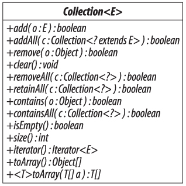

# 第十二章\(集合接口\)

《《《 [返回首页](../../)   
 《《《 [上一节](../di-shi-yi-zhang-chu-bu-cuo-shi/11.5-ji-he-he-xian-cheng-an-quan.md)

## 集合接口

接口集合（参见图 `12-1`）定义了我们期望的除地图以外的任何集合的核心功能。 它提供了四组中的方法。

**添加元素**

```java
   boolean add(E e) // 添加元素e
   boolean addAll(Collection<? extends E> c) // 添加c的内容
```

这些方法返回的布尔结果表明集合是否被调用改变了。 对于集合（如集合），这可能是错误的，如果要求添加已存在的元素，集合将保持不变。 但是方法契约指定了被添加的元素在执行后必须存在，因此，如果集合因任何其他原因（例如，某些集合不允许空元素）拒绝元素，则这些方法必须抛出异常。



图 `12-1`。采集

这些方法的签名表明，正如您所期望的那样，您可以仅添加参数类型的元素或元素集合。

**删除元素**

```java
   boolean remove(Object o) // remove the element o
   void clear() // remove all elements
   boolean removeAll(Collection<?> c) // remove the elements in c
   boolean retainAll(Collection<?> c) // remove the elements *not* in c
```

如果元素 `0` 为空，则删除集合中的空值（如果存在）。 否则，如果存在一个元素 `e`，其等于（`e`），则它将其删除。 如果没有，它将保持集合不变。 如果此组中的方法返回布尔值，则如果集合因应用操作而发生更改则值为 `true`。 与添加元素的方法相比，这些方法（以及下一个组的方法）将接受任何类型的元素或元素集合。 稍后我们将解释这一点，当我们看看使用这些方法的例子时。

**查询集合的内容**

```java
   boolean contains(Object o)             // 如果o存在，则为true
   boolean containsAll(Collection<?> c) // 如果集合中存在c的所有元素，则返回 true
   boolean isEmpty()                     // 如果没有元素存在，则返回 true
   int size()                             // 返回元素数量（如果小于则返回 Integer.MAX_VALUE）
```

对于超大型集合，大小返回 `Integer.MAX_VALUE` 的决定很可能是基于这样的假设，即具有超过 `20` 亿个元素的集合很少会出现。即便如此，一种提出异常而不是返回任意值的替代设计也有一定的优点，即确保规模合同能够清楚地表明，如果它能成功返回一个值，那么这个值就是正确的。

**使集合的内容可用于进一步处理**

```java
   Iterator<E> iterator() // 在元素上返回一个迭代器
   Object[] toArray() // 将内容复制到 Object[]
   <T> T[] toArray(T[] t) // 将内容复制到 T []（对于任何 T）
```

该组中的最后两种方法将集合转换为数组。 第一种方法将创建一个新的 `Object` 数组，第二个方法接受一个 `T` 数组并返回一个包含集合元素的相同类型的数组。

这些方法非常重要，因为尽管现在应该将数组视为遗留数据类型（请参阅第 `6.9` 节），但许多 `API`，特别是早于 `Java` 集合框架的 `API`，都有接受或返回数组的方法。

正如在第 `6.4` 节中讨论的那样，为了在运行时提供数组的可调整类型，第二个方法的参数是必需的，尽管它也可以有另一个目的：如果有空间，集合的元素被放置在 否则，创建一个新类型的数组。 如果您想允许 `toArray` 方法重用您提供的数组，可以使用第一种情况; 这可以更有效率，特别是如果该方法被重复调用。 第二种情况更方便 - 一种常见而直接的用法是提供一个零长度的数组：

```java
   Collection<String> cs = ...
   String[] sa = cs.toArray(new String[0]);
```

一个更有效的替代方法是，如果一个类不止一次地使用这个习语，那就是声明一个所需类型的空数组，然后可以根据需要多次使用它：

```java
   private static final String[] EMPTY_STRING_ARRAY = new String[0];
   Collection<String> cs = ...
   String[] sa = cs.toArray(EMPTY_STRING_ARRAY);
```

为什么在 `toArray` 的声明中允许任何类型的 `T`？ 一个原因是如果集合碰巧包含这种类型的元素，则可以灵活地分配更具体的数组类型：

```java
   List<Object> l = Array.asList("zero","one");
   String[] a = l.toArray(new String[0]);
```

在这里，一个对象列表恰巧只包含字符串，所以它可以转换成一个字符串数组，类似于 `6.2` 节所述的提升方法。

如果列表包含不是字符串的对象，则会在运行时捕获该错误，而不是编译期：

```java
   List<Object> l = Array.asList("zero","one",2);
   String[] a = l.toArray(new String[0]); // 运行期错误
```

在这里，调用会引发 `ArrayStoreException`，这是在尝试将数组分配给具有不相容的指定类型的数组时发生的异常。

一般来说，人们可能希望将给定类型的集合复制到更具体类型的数组中（例如，将对象列表复制到字符串数组中，如前所示）或更一般类型（ 例如，将一个字符串列表复制到一个对象数组中）。 人们永远不想将给定类型的集合复制到完全不相关类型的数组中（例如，将整数列表复制到字符串数组中始终是错误的）。 但是，在 `Java` 中没有办法指定这个约束，所以这些错误在运行时被捕获而不是编译时。

这种设计的一个缺点是它不适用于原始类型的数组：

```java
   List<Integer> l = Array.asList(0,1,2);
   int[] a = l.toArray(new int[0]); // 编译错误
```

这是非法的，因为方法调用中的类型参数T一如既往必须是引用类型。如果我们用 `int` 来替换两个 `int` 实例，调用将会起作用，但通常这不会执行，因为出于性能或兼容性的原因，我们需要一个原始类型的数组。 在这种情况下，除了显式复制数组外，没有其他用途。

```java
   List<Integer> l = Array.asList(0,1,2);
   int[] a = new int[l.size()];
   for (int i=0; i<l.size(); i++) a[i] = l.get(i);
```

集合框架不包括将集合转换为基本类型数组的便利方法。 幸运的是，这只需要几行代码。

《《《 [下一节](12.1-shi-yong-ji-he-fang-fa.md)   
 《《《 [返回首页](../../)

