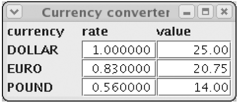

# 9.5 主题观察者

《《《 [返回首页](../../)  
《《《 [上一节](9.4-ce-lve.md)

## 主题观察者

我们用一个更加扩展的例子来完成，说明通用的 `Subject-Observer` 模式。与策略模式一样，`Subject-Observer` 模式使用并行类层次结构，但这次我们需要两个具有相互递归边界的类型变量，一个代表特定类型的主体，一个代表特定类型的观察者。这是我们的第一个带有相互递归边界的类型变量的例子。

`Java` 库在包 `java.util` 中使用 `Observable` 类和接口 `Observer`（前者对应于主题）实现了非通用版本的 `Subject-Observer` 模式，其签名示例如图 `9-8` 所示。

`Observable` 类包含注册观察者（`addObserver`）的方法，指示 `observable` 已更改（`setChanged`），并通知所有观察者有任何更改（`notifyObservers`）等等。 `notifyObservers` 方法可以接受将被广播给所有观察者的 `Object` 类型的任意参数。 `Observer` 接口指定由 `notifyObservers` 调用的更新方法。这个方法有两个参数：第一个是 `Observable` 类型，它是已经改变的主体;第二种类型的对象是广播参数。

对象在方法签名中的出现常常表明有机会进行基因组化。 因此，我们应该期望通过添加与参数类型相对应的类型参数 `A` 来生成类。 此外，我们可以用 `Observable` 和 `Observer` 自己替换类型参数 `S` 和 `O`（用于 `Subject` 和 `Observer`）。 然后在观察者的更新方法中，您可以调用主体 `S` 支持的任何方法，而无需先投射。

例 `9-9` 显示了如何为 `Observable` 类和 `Observer` 接口指定相应的通用签名。 这里是相关的标题：

```java
   public class Observable<S extends Observable<S,O,A>, O extends Observer<S,O,A>,A>
   public interface Observer<S extends Observable<S,O,A>, O extends Observer<S,O,A>,A>
```

这两个声明都采用相同的三个类型参数。这些声明是有趣的，因为它们说明了类型参数的范围可以是相互递归的：所有三个类型参数都出现在前两个的范围内。在此之前，我们看到了简单递归的其他例子，例如 `Comparable` 和 `Enum` 的声明，以及前面关于 `Strategy` 模式的部分。但这是我们第一次看到相互递归。

检查声明的主体，可以看到 `O` 但不是 `S` 出现在 `Observable` 类的主体中，并且 `S` 但不是 `O` 出现在 `Observer` 接口的主体中。所以你可能会想：通过从 `Observable` 中删除类型参数 `S` 和 `Observer` 中的类型参数 `O`，可以简化声明吗？但是这是行不通的，因为你需要 `S` 在 `Observable` 的范围内，所以它可以作为参数传递给 `Observer`，并且你需要 `O` 在 `Observer` 的范围内，以便它可以作为参数传递给 `Observable`。

如 `5.4.2` 节所述，通用声明使用存根。我们根据 `Observable` 和 `Observer` 的通用签名来编译客户端，但是针对标准 `Java` 分发中的类文件运行代码。我们使用存根，因为我们不想对库的源进行任何更改，因为它由 `Sun` 维护。

例 `9-8`。泛型之前的可观察和观察者

```java
   package java.util;
    public class Observable {
      public void addObserver(Observer o) {...}
      protected void clearChanged() {...}
      public int countObservers() {...}
      public void deleteObserver(Observer o) {...}
      public boolean hasChanged() {...}
      public void notifyObservers() {...}
      public void notifyObservers(Object arg) {...}
      protected void setChanged() {...}
    }

   package java.util;
    public interface Observer {
      public void update(Observable o, Object arg);
    }
```

例9-9。 泛型的可观察和观察者

```java
   package java.util;
    class StubException extends UnsupportedOperationException {}
    public class Observable<S extends Observable<S,O,A>, O extends Observer<S,O,A>, A> {
      public void addObserver(O o) { throw new StubException(); }
      protected void clearChanged() { throw new StubException(); }
      public int countObservers() { throw new StubException(); }
      public void deleteObserver(O o) { throw new StubException(); }
      public boolean hasChanged() { throw new StubException(); }
      public void notifyObservers() { throw new StubException(); }
      public void notifyObservers(A a) { throw new StubException(); }
      protected void setChanged() { throw new StubException(); }
    }
   package java.util;
    public interface Observer<S extends Observable<S,O,A>, O extends Observer<S,O,A>, A> {
      public void update(S o, A a);
    }
```

作为 `Observable` 和 `Observer` 的演示客户端，示例 `9-10` 介绍了货币转换器。 转换器的屏幕截图如图 `9-1` 所示。 转换器允许您为三种货币（美元，欧元和英镑）中的每一种输入转换率，并以任何货币输入一个值。 更改费率条目会导致重新计算相应的值; 更改值的条目会导致重新计算所有值。

客户端通过声明 `CModel` 为 `Observable` 的子类并将 `CView` 作为 `Observer` 的子接口来实例化模式。 此外，参数类型被实例化为 `Currency`，一个枚举类型，可用于通知观察者该主题的哪些组件已更改。 这里是相关的标题：

```java
   enum Currency { DOLLAR, EURO, POUND }
   class CModel extends Observable<CModel, CView, Currency>
   interface CView extends Observer<CModel, CView, Currency>
```

类RateView和ValueView实现CView，类Converter定义控制显示的顶层框架。

CModel类有一个方法来设置和获取给定货币的汇率和价值。汇率存储在一个映射中，该映射为每种货币分配一个汇率，并存储该值（作为一个长，



图 `9-1`。 货币换算

以美分，欧分或便士）与其实际货币。 要计算给定货币的价值，该值除以实际货币的利率并乘以给定货币的利率。

每当费率发生变化时，`CModel` 类将调用 `RateView` 的更新方法，并将相应货币作为参数传递（因为只需更新货币的费率和价值）; 当值更改时，它会调用 `ValueView` 的更新方法，并将 `null` 作为参数传递（因为需要更新所有货币的值）。

我们编译并运行代码如下。 首先，我们编译 `Observable` 和 `Observer` 的通用版本：

```java
   % javac -d . java/util/Observable.java java/util/Observer.java
```

由于这些包位于 `java.util` 包中，它们必须保存在当前目录的子目录 `java/util` 中。 其次，我们在包 `com.eg.converter` 中编译 `Converter` 和相关的类。 默认情况下，`Java` 编译器首先搜索当前目录中的类文件（即使是标准库）。 因此，编译器使用为 `Observable` 和 `Observer` 生成的存根类文件，它们具有正确的通用签名（但不包含可运行代码）：

```java
   % javac -d . com/eg/converter/Converter.java
```

第三，我们运行转换器的类文件。 默认情况下，`java` 运行时不会首先在当前目录中搜索包 `java` 和 `javax` 中的类文件 - 由于安全原因，它们始终从标准库中获取。 因此，运行时使用 `Observable` 和 `Observer` 的标准类文件，其中包含我们想要运行的遗留代码（但没有正确的通用签名）：

```java
   % java com.eg.converter.Converter
```

例9-10。 货币换算

```java
   import java.util.*;
   import javax.swing.*;
   import javax.swing.event.*;
   import java.awt.*;
   import java.awt.event.*;
    enum Currency { DOLLAR, EURO, POUND }
    class CModel extends Observable<CModel,CView,Currency> {
      private final EnumMap<Currency,Double> rates;
      private long value = 0; // cents, euro cents, or pence
      private Currency currency = Currency.DOLLAR;
      public CModel() {
        rates = new EnumMap<Currency,Double>(Currency.class);
      }
      public void initialize(double... initialRates) {
        for (int i=0; i<initialRates.length; i++)
        setRate(Currency.values()[i], initialRates[i]);
      }
      public void setRate(Currency currency, double rate) {
        rates.put(currency, rate);
        setChanged();
        notifyObservers(currency);
      }
      public void setValue(Currency currency, long value) {
        this.currency = currency;
        this.value = value;
        setChanged();
        notifyObservers(null);
      }
      public double getRate(Currency currency) {
        return rates.get(currency);
      }
      public long getValue(Currency currency) {
        if (currency == this.currency)
          return value;
        else
          return Math.round(value * getRate(currency) / getRate(this.currency));
      }
    }
    interface CView extends Observer<CModel,CView,Currency> {}
    class RateView extends JTextField implements CView {
      private final CModel model;
      private final Currency currency;
      public RateView(final CModel model, final Currency currency) {
        this.model = model;
        this.currency = currency;
        addActionListener(new ActionListener() {
          public void actionPerformed(ActionEvent e) {
            try {
              double rate = Double.parseDouble(getText());
              model.setRate(currency, rate);
            } catch (NumberFormatException x) {}
          }
        });
        model.addObserver(this);
      }
      public void update(CModel model, Currency currency) {
        if (this.currency == currency) {
          double rate = model.getRate(currency);
          setText(String.format("%10.6f", rate));
        }
      }
    }
    class ValueView extends JTextField implements CView {
      private final CModel model;
      private final Currency currency;
      public ValueView(final CModel model, final Currency currency) {
        this.model = model;
        this.currency = currency;
        addActionListener(new ActionListener() {
          public void actionPerformed(ActionEvent e) {
            try {
              long value = Math.round(100.0*Double.parseDouble(getText()));
              model.setValue(currency, value);
            } catch (NumberFormatException x) {}
          }
        });
        model.addObserver(this);
      }
      public void update(CModel model, Currency currency) {
        if (currency == null || currency == this.currency) {
          long value = model.getValue(this.currency);
          setText(String.format("%15d.%02d", value/100, value%100));
        }
      }
    }
    class Converter extends JFrame {
      public Converter() {
        CModel model = new CModel();
        setTitle("Currency converter");
        setLayout(new GridLayout(Currency.values().length+1, 3));
        add(new JLabel("currency"));
        add(new JLabel("rate"));
        add(new JLabel("value"));
        for (Currency currency : Currency.values()) {
          add(new JLabel(currency.name()));
          add(new RateView(model, currency));
          add(new ValueView(model, currency));
        }
        model.initialize(1.0, 0.83, 0.56);
        setDefaultCloseOperation(JFrame.EXIT_ON_CLOSE);
        pack();
      }
      public static void main(String[] args) {
        new Converter().setVisible(true);
      }
    }
```

因此，当我们使用标准库类的存根时，我们不需要修改类路径，就像我们在 `5.4.2` 节中所做的那样，因为默认情况下会获得正确的行为。 （如果您确实想在运行时更改标准库类，则可以使用 `-Xbootclass` 路径标志。）

这就结束了我们对泛型的讨论。 现在，您已经有了一个全面的基础，可以使用其他人定义的通用库，定义自己的库，将遗留代码发展为通用代码，了解对泛型的限制并避免陷阱，在需要时使用检查和专业化，以及在设计模式中利用泛型。

泛型最重要的用途之一是集合框架，在本书的下一部分，我们将向您展示如何有效地使用此框架并提高您作为 `Java` 程序员的工作效率。

《《《 [下一节](../../di-er-bu-fen-ji-he/)  
《《《 [返回首页](../../)

